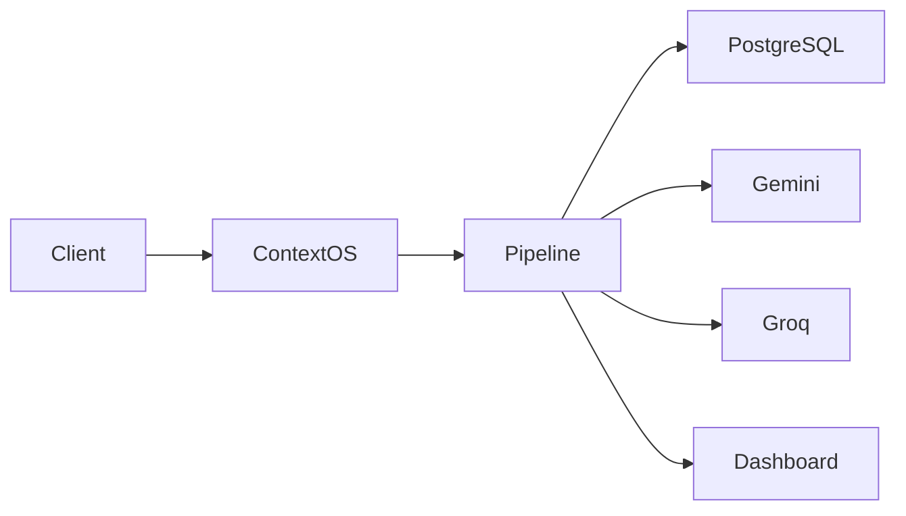

# ContextOS

> **An AI Middleware Layer that Adds Memory, Security, Intelligent Routing, and Observability to Any LLM**

ContextOS is a production-grade AI middleware platform that sits between your application and any Large Language Model (LLM). Instead of directly communicating with an LLM, every request passes through a configurable pipeline that enriches it with semantic memory, prompt security, context optimization, intelligent model routing, response validation, and real-time observability.

---

## Overview

Modern AI applications require much more than simply calling an LLM API. Developers must independently implement conversation memory, security checks, context management, model selection, response validation, monitoring, and debugging.

ContextOS centralizes these responsibilities into a reusable middleware layer, allowing applications to focus on business logic while the platform handles AI infrastructure concerns.

---

## Key Features

| Capability | Description |
|------------|-------------|
| Semantic Memory | Retrieves relevant historical context using vector search. |
| Prompt Security | Detects and masks sensitive information before model execution. |
| Context Compression | Optimizes retrieved context to fit configurable token budgets. |
| Intelligent Routing | Dynamically selects the most suitable LLM. |
| Multi-Provider Support | Works seamlessly with multiple LLM providers. |
| Response Validation | Ensures generated responses meet safety requirements. |
| Trace Logging | Records every pipeline stage for debugging and auditing. |
| Real-Time Dashboard | Visualizes request execution, latency, and pipeline metrics. |

---

## Architecture



---

## Processing Pipeline

Every request passes through the following middleware stages before reaching the language model.

```text
User Request
      │
      ▼
PII & Prompt Security
      │
      ▼
Semantic Memory Retrieval
      │
      ▼
Context Compression
      │
      ▼
Intelligent Model Routing
      │
      ▼
LLM Execution
      │
      ▼
Response Validation
      │
      ▼
Trace Logging
      │
      ▼
Client Response
```

---

## Technology Stack

| Layer | Technologies |
|--------|--------------|
| Frontend | Next.js, Tailwind CSS |
| Backend | FastAPI |
| Database | PostgreSQL, pgvector |
| ORM | SQLAlchemy |
| Authentication | JWT |
| AI Providers | Gemini, Groq |
| Real-Time | WebSockets |
| Deployment | Vercel, Render |
| Containerization | Docker |

---

## Repository Structure

```text
contextos/
│
├── backend/
├── frontend/
├── docs/
├── assets/
├── docker/
│
├── README.md
├── LICENSE
└── requirements.txt
```

---

## Getting Started

### Clone the repository

```bash
git clone https://github.com/username/contextos.git
cd contextos
```

### Backend

```bash
cd backend
pip install -r requirements.txt
uvicorn app.main:app --reload
```

### Frontend

```bash
cd frontend
npm install
npm run dev
```

---

## Environment Variables

Create a `.env` file and configure:

```env
DATABASE_URL=
JWT_SECRET=
GEMINI_API_KEY=
GROQ_API_KEY=
SUPABASE_URL=
SUPABASE_KEY=
```

---

## API Overview

| Method | Endpoint | Description |
|--------|----------|-------------|
| POST | `/chat` | Process an AI request |
| GET | `/history` | Retrieve conversation history |
| GET | `/trace/{id}` | View execution trace |
| GET | `/metrics` | Pipeline metrics |
| GET | `/health` | Service health status |

---

## Documentation

Additional documentation is available in the `docs/` directory.

- Architecture
- Pipeline
- API Reference
- Database Design
- Deployment Guide
- Security
- Engineering Decisions

---

## Roadmap

- [x] Semantic memory
- [x] Multi-LLM support
- [x] Prompt security
- [x] Intelligent routing
- [x] Response validation
- [x] Real-time dashboard
- [ ] Plugin architecture
- [ ] Kubernetes deployment
- [ ] Distributed tracing
- [ ] Multi-tenant support

---

## License

This project is licensed under the MIT License.

---

## Author

**Dishita Chaturvedi**

AI/ML Engineering Student • Full-Stack Developer • AI Infrastructure Enthusiast
