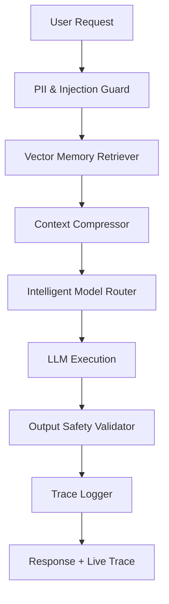
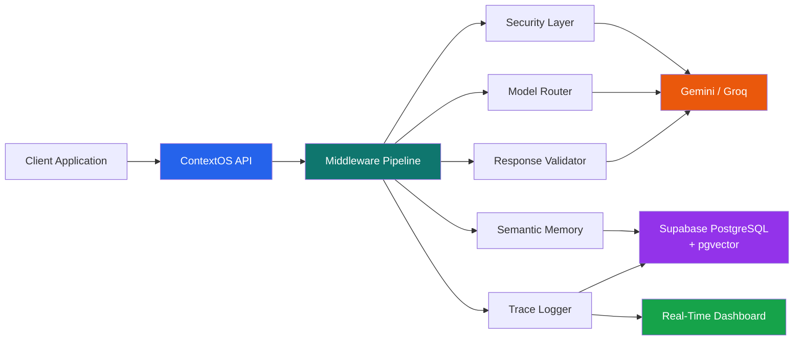

# ContextOS

> An AI middleware layer that adds semantic memory, prompt security, intelligent routing, and real-time observability to any LLM application.

ContextOS sits between your application and an LLM. Every request flows through a 7-stage pipeline that adds context, security, and observability before the model ever sees your prompt.

<p align="center">

[](https://contextos-zeta.vercel.app)
[](https://contextos-backend-9pbu.onrender.com/docs)
[](LICENSE)

</p>

---

## What It Does

Instead of building memory, security, routing, and monitoring into every LLM project separately, ContextOS centralizes all of it into one reusable middleware service. Send a request to ContextOS instead of directly to an LLM and get back a sanitized, context-aware, validated response — along with a full execution trace.

---
## Why ContextOS?

Building production AI applications requires much more than calling an LLM API. Every application eventually needs conversation memory, prompt security, intelligent model selection, response validation, and observability. These capabilities are often implemented independently in every project.

ContextOS centralizes these concerns into a reusable middleware layer, allowing developers to integrate production-ready AI infrastructure without rebuilding it from scratch.

---

## The Pipeline


```mermaid
flowchart TD
A[User Request]
B[PII & Injection Guard]
C[Vector Memory Retriever]
D[Context Compressor]
E[Intelligent Model Router]
F[LLM Execution]
G[Output Safety Validator]
H[Trace Logger]
I[Response + Live Trace]

A-->B-->C-->D-->E-->F-->G-->H-->I
```

| Stage | What it does |
|---|---|
| PII & Injection Guard | Masks emails, phones, Aadhaar, PAN. Blocks jailbreak attempts. |
| Vector Memory Retriever | Embeds prompt via Gemini, retrieves semantically similar past messages from pgvector. |
| Context Compressor | Trims retrieved memory to fit user's token budget using tiktoken. |
| Intelligent Model Router | Classifies prompt and routes to cheapest capable model. |
| LLM Execution | Calls Groq or Gemini with injected context. Exponential backoff retry. |
| Output Safety Validator | LLM-as-judge toxicity scoring. Blocks above user threshold. |
| Trace Logger | Batch writes all stage traces to DB. Streams live via WebSocket. |

---

## System Architecture


```mermaid
flowchart LR

    A["Client Application"] --> B["ContextOS API"]

    B --> C["Middleware Pipeline"]

    C --> D["Security Layer"]
    C --> E["Semantic Memory"]
    C --> F["Model Router"]
    C --> G["Response Validator"]
    C --> H["Trace Logger"]

    D --> I["Gemini / Groq"]
    E --> J["Supabase PostgreSQL<br/>+ pgvector"]
    F --> I
    G --> I

    H --> K["Real-Time Dashboard"]
    H --> J

    style B fill:#2563eb,color:#fff
    style C fill:#0f766e,color:#fff
    style J fill:#9333ea,color:#fff
    style I fill:#ea580c,color:#fff
    style K fill:#16a34a,color:#fff
```

## Screenshots

| Dashboard | Playground |
|-----------|------------|
|  |  |

| Pipeline | Analytics |
|-----------|-----------|
|  |  |

---
## Tech Stack

| Layer | Technologies |
|---|---|
| Frontend | Next.js 16, Tailwind CSS v4, Zustand, Recharts |
| Backend | FastAPI, async SQLAlchemy, asyncpg |
| Database | Supabase PostgreSQL, pgvector (3072-dim vectors) |
| AI — Generation | Groq (Llama 3.3 70B, Llama 3.1 8B, Mixtral 8x7B) |
| AI — Embeddings | Gemini embedding-001 |
| Authentication | JWT + bcrypt + API keys (`ctx_` prefix) |
| Real-Time | WebSockets (FastAPI native) |
| Deployment | Vercel (frontend), Render (backend) |

---
## Repository Structure

```text
contextos/
├── backend/
├── frontend/
├── docs/
├── assets/
├── docker/
├── README.md
└── LICENSE
```
---
## Getting Started

```bash
git clone https://github.com/dishi575/contextos.git
cd contextos
```

**Backend**
```bash
cd backend
pip install -r requirements.txt  # requires Python 3.11
uvicorn app.main:app --reload
```

**Frontend**
```bash
cd frontend
npm install
npm run dev
```

---

## Environment Variables

**`backend/.env`**

| Variable | Description |
|---|---|
| `DATABASE_URL` | `postgresql+asyncpg://...supabase.co/postgres` |
| `SECRET_KEY` | JWT signing secret (`openssl rand -hex 32`) |
| `GEMINI_API_KEY` | From aistudio.google.com |
| `GROQ_API_KEY` | From console.groq.com |
| `DEBUG` | `True` for local, `False` for production |

**`frontend/.env.local`**

| Variable | Description |
|---|---|
| `NEXT_PUBLIC_API_URL` | Backend URL |
| `NEXT_PUBLIC_WS_URL` | Backend WebSocket URL (`ws://` or `wss://`) |

---

## API Overview

| Method | Endpoint | Purpose |
|---|---|---|
| POST | `/api/auth/register` | Register operator account |
| POST | `/api/auth/login` | Login, returns JWT |
| PATCH | `/api/auth/policy` | Update pipeline config |
| POST | `/api/chat/` | Run request through full pipeline |
| GET | `/api/chat/sessions` | List conversation sessions |
| GET | `/api/traces/{message_id}` | Get pipeline traces for a message |
| GET | `/api/traces/stats/summary` | Aggregate dashboard stats |
| WS | `/ws/traces?token=JWT` | Live trace event stream |
| GET | `/health` | Health check |

Full API docs at [contextos-backend-9pbu.onrender.com/docs](https://contextos-backend-9pbu.onrender.com/docs)

---

## Engineering Highlights

- 7-stage configurable middleware pipeline with per-stage trace logging
- Semantic memory using pgvector cosine similarity (`<=>` operator) in PostgreSQL
- Token budget context compression with tiktoken — logs tokens saved per request
- Multi-provider model routing — Groq for speed, Gemini for reasoning/coding, with automatic fallback
- Per-user pipeline policy (token budget, temperature, toxicity threshold, memory chunks, PII masking, provider preference)
- Real-time WebSocket trace streaming with live pipeline stage animation
- Indian-context PII detection (Aadhaar, PAN, +91 phone numbers)
- LLM-as-judge output toxicity validation with configurable threshold
- JWT + API key dual authentication

---
## Documentation

Detailed documentation for the project is available in the `docs/` directory.

| Guide | Description |
|--------|-------------|
| `architecture.md` | System architecture and component interactions |
| `pipeline.md` | Detailed explanation of the 7-stage middleware pipeline |
| `api.md` | REST and WebSocket API reference |
| `database.md` | Database schema and vector storage |
| `deployment.md` | Local setup and production deployment |
| `security.md` | Authentication, authorization, and security mechanisms |
| `engineering.md` | Design decisions and implementation trade-offs |

---
## Roadmap

- [x] 7-stage middleware pipeline
- [x] Semantic memory with pgvector
- [x] Multi-provider routing (Groq + Gemini)
- [x] Real-time observability dashboard
- [x] Per-user pipeline policy configuration
- [x] WebSocket live trace streaming
- [ ] Plugin SDK for custom pipeline stages
- [ ] Docker + docker-compose setup
- [ ] Multi-tenant architecture
- [ ] Distributed tracing (OpenTelemetry)

---

## Author

**Dishita Chaturvedi** — AI/ML Engineer · Full-Stack Developer  
[github.com/dishi575](https://github.com/dishi575)

---

## License

MIT
