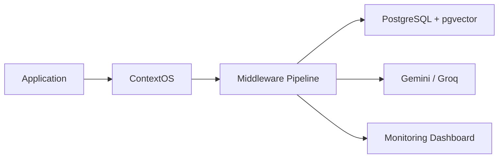
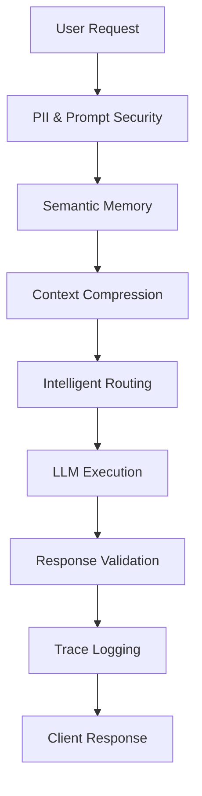

# ContextOS

> **An AI Middleware Layer that Adds Memory, Security, Intelligent Routing, and Observability to Any LLM**

ContextOS is a production-grade AI middleware platform that sits between applications and Large Language Models (LLMs). Every request flows through an intelligent processing pipeline that adds semantic memory, prompt security, context optimization, model routing, response validation, and end-to-end observability before reaching an LLM.

<p align="center">

[](https://contextos-zeta.vercel.app)
[](https://contextos-backend-9pbu.onrender.com/docs)
[](docs/)
[](LICENSE)

</p>

---

## Overview

ContextOS abstracts the infrastructure required to build production-ready AI applications. Instead of embedding memory, security, routing, and monitoring logic into every project, these responsibilities are centralized into a reusable middleware layer.

---

## Core Capabilities

| Capability | Description |
|------------|-------------|
| Semantic Memory | Retrieves relevant historical context using pgvector. |
| Prompt Security | Detects PII and common prompt injection patterns. |
| Context Compression | Optimizes retrieved context to fit token budgets. |
| Intelligent Routing | Selects the most appropriate LLM dynamically. |
| Multi-Provider Support | Supports Gemini and Groq providers. |
| Response Validation | Evaluates responses before returning them. |
| Observability | Streams execution traces and pipeline metrics in real time. |

---

## System Architecture


```mermaid
flowchart LR

Client["Application"]
Gateway["ContextOS"]
Pipeline["Middleware Pipeline"]
DB["PostgreSQL + pgvector"]
LLM["Gemini / Groq"]
Dashboard["Monitoring Dashboard"]

Client --> Gateway
Gateway --> Pipeline
Pipeline --> DB
Pipeline --> LLM
Pipeline --> Dashboard
```

---

## Request Pipeline


```mermaid
flowchart TD

A[User Request]
B[PII & Prompt Security]
C[Semantic Memory]
D[Context Compression]
E[Intelligent Routing]
F[LLM Execution]
G[Response Validation]
H[Trace Logging]
I[Client Response]

A-->B-->C-->D-->E-->F-->G-->H-->I
```

---

## Screenshots

| Feature | Preview |
|---------|---------|
| Dashboard | `assets/screenshots/dashboard.png` |
| Playground | `assets/screenshots/playground.png` |
| Pipeline | `assets/screenshots/pipeline.png` |
| Analytics | `assets/screenshots/analytics.png` |
| Settings | `assets/screenshots/settings.png` |
| API Docs | `assets/screenshots/swagger.png` |

---

## Technology Stack

| Layer | Technologies |
|-------|--------------|
| Frontend | Next.js, Tailwind CSS, Zustand |
| Backend | FastAPI, SQLAlchemy |
| Database | PostgreSQL, pgvector |
| AI | Gemini, Groq |
| Authentication | JWT, API Keys |
| Real-Time | WebSockets |
| Deployment | Vercel, Render |
| Containerization | Docker |

---

## Repository Structure

```text
contextos/
├── backend/
├── frontend/
├── docs/
├── assets/
├── docker/
├── README.md
├── LICENSE
└── docker-compose.yml
```

---

## Getting Started

```bash
git clone https://github.com/dishi575/contextos.git
cd contextos
```

### Backend

```bash
cd backend
pip install -r requirements.txt
uvicorn app.main:app --reload
```

### Frontend

```bash
cd frontend
npm install
npm run dev
```

---

## Environment Variables

| Variable | Description |
|----------|-------------|
| DATABASE_URL | PostgreSQL connection |
| GEMINI_API_KEY | Gemini API key |
| GROQ_API_KEY | Groq API key |
| JWT_SECRET | JWT signing secret |

See `docs/deployment.md` for the complete configuration.

---

## API Overview

| Method | Endpoint | Purpose |
|--------|----------|---------|
| POST | `/api/chat` | Execute the middleware pipeline |
| GET | `/api/chat/sessions` | List conversation sessions |
| GET | `/api/traces/{id}` | Retrieve execution traces |
| PATCH | `/api/auth/policy` | Update pipeline configuration |
| GET | `/health` | Health check |

Complete API documentation is available in `docs/api.md`.

---

## Engineering Highlights

- Seven-stage configurable middleware pipeline
- Semantic memory using PostgreSQL + pgvector
- Configurable token-budget context compression
- Intelligent multi-provider model routing
- JWT authentication and API key support
- Real-time trace streaming over WebSockets
- Modular architecture for extending pipeline stages

---

## Documentation

Detailed technical documentation is available in the `docs/` directory.

| Document | Description |
|----------|-------------|
| `overview.md` | Project overview |
| `architecture.md` | System architecture |
| `pipeline.md` | Pipeline internals |
| `api.md` | REST & WebSocket APIs |
| `database.md` | Database schema |
| `security.md` | Security model |
| `deployment.md` | Deployment guide |
| `engineering.md` | Design decisions |

---

## Roadmap

- [x] Semantic memory
- [x] Prompt security
- [x] Intelligent routing
- [x] Real-time dashboard
- [x] Multi-provider support
- [ ] Plugin SDK
- [ ] Distributed tracing
- [ ] Kubernetes deployment
- [ ] Multi-tenant architecture

---

## Author

**Dishita Chaturvedi**

AI/ML Engineer • Full-Stack Developer • AI Infrastructure

---

## License

Licensed under the MIT License.
